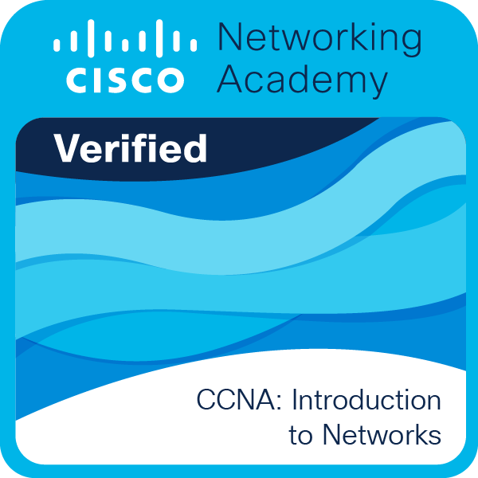
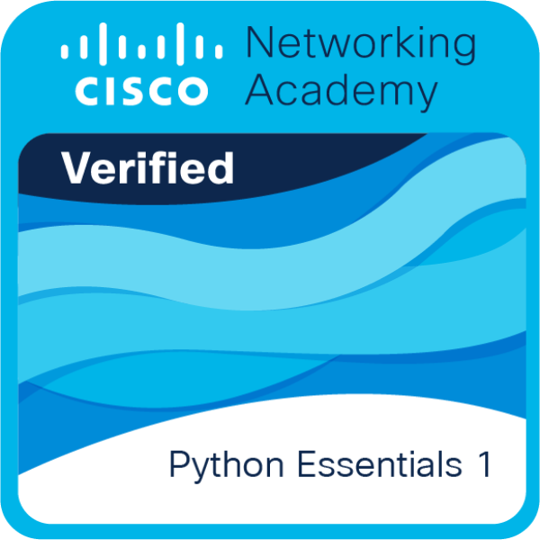

  

 
  
  ### ⁕ Technologies Used ⁕
  
  
  
  
  
  
  
  
  
  
  
  
  
  

  ##
 

 

  ### ⁕ Contact me ⁕
  
  
  
  

  ## ⁕ A quick visit to my projects ⁕
  
  
  &nbsp;&nbsp;&nbsp; <!-- Adiciona 3 espaços entre as imagens -->
  

## ⁕ Badges ⁕

&nbsp;

&nbsp;

